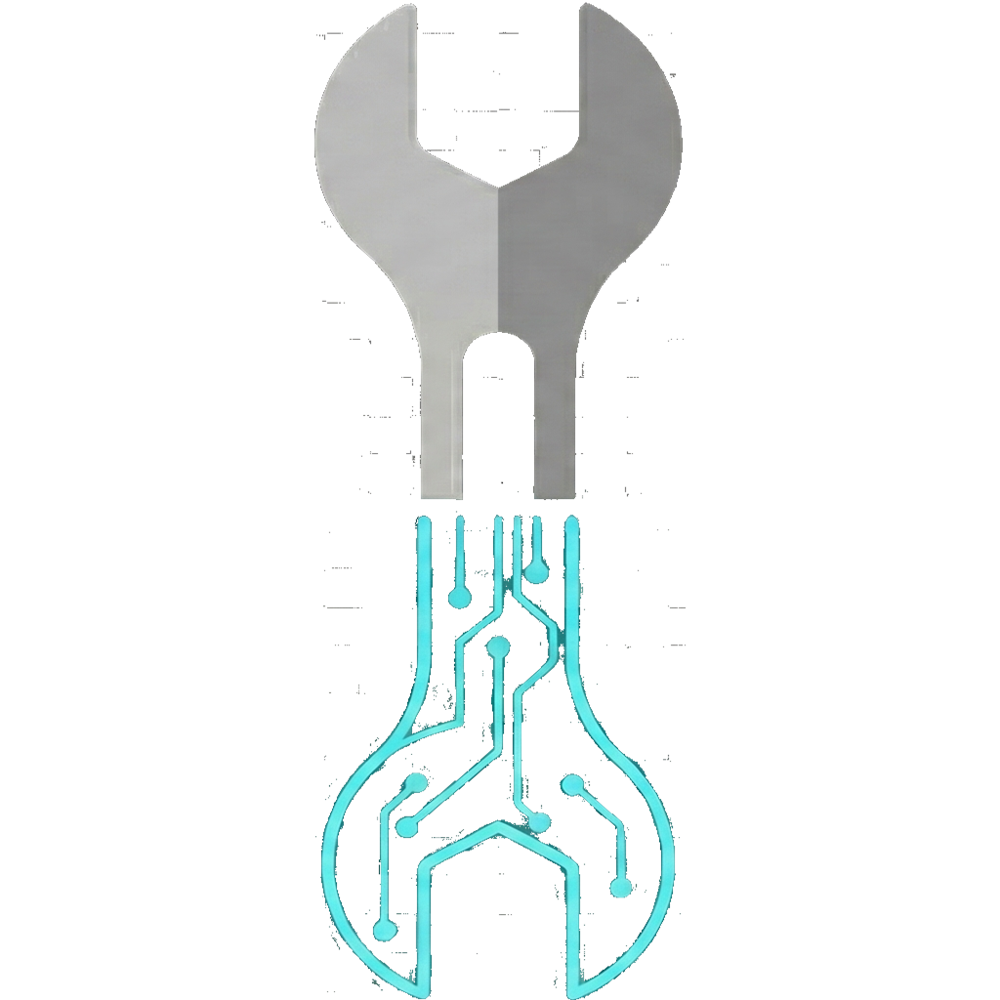

<p align="center">
  
</p>

<h1 align="center">repAire</h1>
<p align="center"><strong>Le mécano IA dans ta poche</strong></p>

<p align="center">
  
  
  
  
</p>

---

## Le problème

Tu es en balade, ton pneu crève, ta chaîne saute ou tes freins lâchent... et tu n'y connais rien en mécanique.

## La solution

**repAire** diagnostique la panne à partir d'une simple photo et te guide pas-à-pas pour réparer toi-même, avec des mots simples (niveau enfant de 8 ans) et les outils que tu as sous la main.

---

## Fonctionnalités

### Diagnostic IA par photo
- Prends une photo de la panne
- Décris le problème (bruit, sensation)
- L'IA analyse et renvoie un guide de réparation étape par étape
- Lecture vocale des étapes (mains libres pour réparer)
- Boutons "Voir la pièce" et "Voir l'outil" liés au Codex

### Codex interactif
- Vue éclatée du vélo avec zones cliquables (guidon, freins, roue, transmission, pédalier, pneu)
- Vue éclatée de la trottinette électrique (guidon, pliage, roues, freins)
- Établi des outils : pompes, clés Allen, clés plates, dégraissant, tournevis, démonte-pneus
- Chaque zone : image HD + explication détaillée

### Guides SOS hors-ligne
- **Vélo** : Chaîne sautée, Pneu crevé, Frein défaillant
- **Trottinette** : Pneu à plat, Guidon lâche, Codes erreur (bips)
- Fonctionnent **sans connexion internet**

### Carnet d'entretien
- Crée un profil par véhicule (Vélo Route, VTT/Gravel, Trottinette)
- Suivi des tâches : pression pneus, graissage chaîne, freins
- Indicateurs visuels : OK / Bientôt / En retard / Jamais fait
- Renommage et suppression des véhicules

---

## Véhicules supportés

| Véhicule | Diagnostic IA | Codex | Carnet |
|---|---|---|---|
| Vélo (Route/Ville/VAE) | ✅ | ✅ | ✅ |
| VTT / Gravel | ✅ | ✅ | ✅ |
| Trottinette Électrique | ✅ (mécanique) | ✅ | ✅ |
| Moto | Bientôt | - | - |

---

## Stack technique

| Techno | Usage |
|---|---|
| **React Native** + **Expo** | Framework mobile |
| **TypeScript** | Typage strict |
| **GPT-4o-mini** (OpenAI) | Diagnostic IA par vision |
| **expo-speech** | Lecture vocale des étapes |
| **expo-image-picker** | Capture photo |
| **AsyncStorage** | Persistance locale (garage, préférences) |
| **EAS Build** | Build APK Android |

---

## Installation (développeur)

```bash
# Cloner le repo
git clone https://github.com/repaireapp/repAire.git
cd repAire

# Installer les dépendances
npm install

# Configurer la clé API OpenAI
echo "OPENAI_API_KEY=sk-votre-cle-ici" > .env

# Lancer en dev
npx expo start

# Ou builder un APK
npx eas build --platform android --profile preview
```

---

## Architecture

```
src/
  constants/colors.ts          # Palette de couleurs
  services/aiService.ts        # Appel GPT-4o-mini + prompts
  services/maintenanceService.ts # CRUD garage (AsyncStorage)
  data/codexData.ts            # Données Codex (images + zones)
  data/offlineGuides.ts        # Guides SOS hors-ligne
  components/ScanModal.tsx     # Animation scan laser
  components/AdModal.tsx       # Modal publicitaire
  components/DisclaimerModal.tsx # Avertissement + permission caméra
  screens/HomeScreen.tsx       # Écran d'accueil
  screens/DiagnosticScreen.tsx # Diagnostic vélo/trottinette
  screens/DiagnosticResultScreen.tsx # Résultat par étapes
  screens/CodexScreen.tsx      # Codex interactif
  screens/MaintenanceScreen.tsx # Carnet d'entretien
app/
  (tabs)/index.tsx             # Routeur principal
  _layout.tsx                  # Layout racine
```

---

## Sécurité

- La clé API est stockée dans `.env` (jamais commitée)
- Les photos ne sont pas stockées sur le serveur
- Filtre de sécurité côté client sur les outils renvoyés par l'IA
- L'IA ne conseille jamais de graisser des freins
- Avertissement de sécurité si danger élevé (cadre fissuré, batterie gonflée)

---

## Licence

MIT

---

<p align="center">
  <strong>repAire</strong> — Parce que tout le monde mérite de savoir réparer son vélo.
</p>
